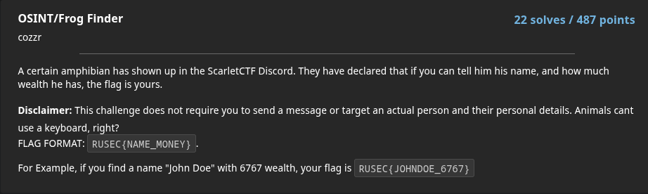
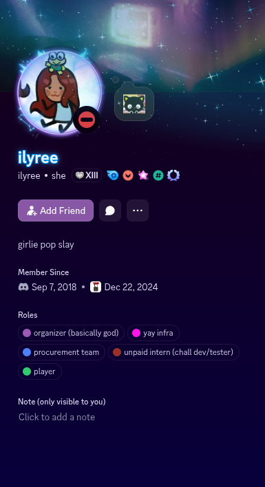
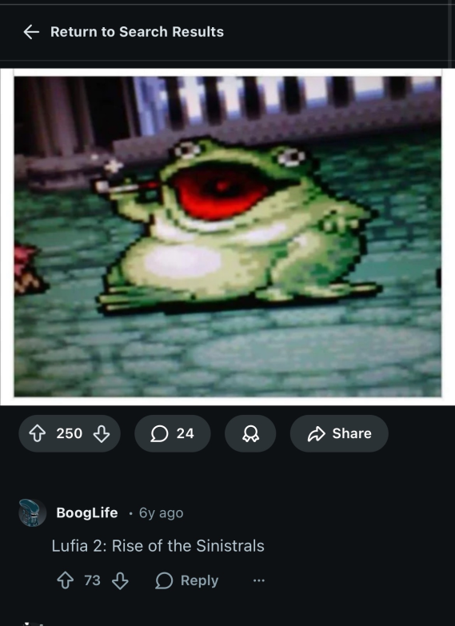
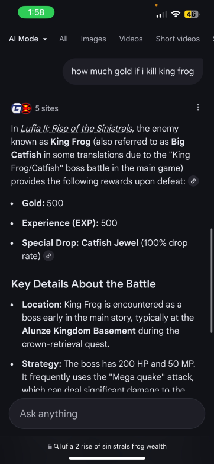

# Frog Finder

## Challenge

## Solution: 

The first clue that can be seen here is it's in ScarletCTF Discord server. I'm assuming we'll just have to look any staff or moderators in the server that have frog as their profile pictures.

Here are our suspects:

Profile 1:

Profile 2: 

For Profile 1, I recognised the frog on the character's head from Sanrio as Keroppi. Now I was really not sure how to find the wealth of this character. So we skip to the second profile.

For Profile 2, I have no clue where the character is from. So I reverse image search using tineye.com and google image search 

From the google reverse image search, I found that the frog came from the game Lufia 2: Rise of the Sinistrals from this reddit post.
 

From there, we can see the name of the frog is King Frog. We now get the first half part of the flag. KINGFROG. 

I searched about King Frog and found out that it is labelled as "normal enemy". Usually in games if you kill enemies you will get rewarded. Based on that, the "wealth" of King Frog could translate to how much reward you will get from killing one King Frog. Here's what came up:

500 gold. Let's try that flag. 
RUSEC{KINGFROG_500}
It's not the flag. Now I have to actually see the gameplay. 

I searched up on youtube; "Lufia 2: Rise of the Sinistrals King Frog". Here's the link to the [video](https://youtu.be/uF6F3XtEUCk?si=UDr9F67XefoClB77)
The game gives the total amount of gold after killing the enemies. Seems like some math needs to be done.

When the user killed 1 snell and 2 King Frog, user received 1032 gold [timestamp: 7:01 - 7:32]
When the user killed 2 snell and 2 King Frog, user received 1364 gold [timestamp: 8:08 - 8:58]

1 snell = 332 gold
2 King Frog = 1032-332 = 700 gold
1 King Frog = 700/2 = 350 gold

The final flag is:
RUSEC{KINGFROG_350}
